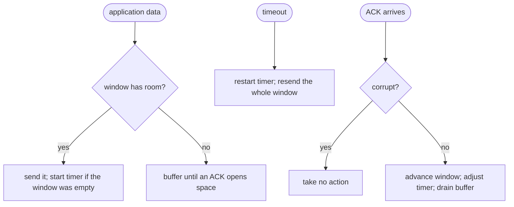
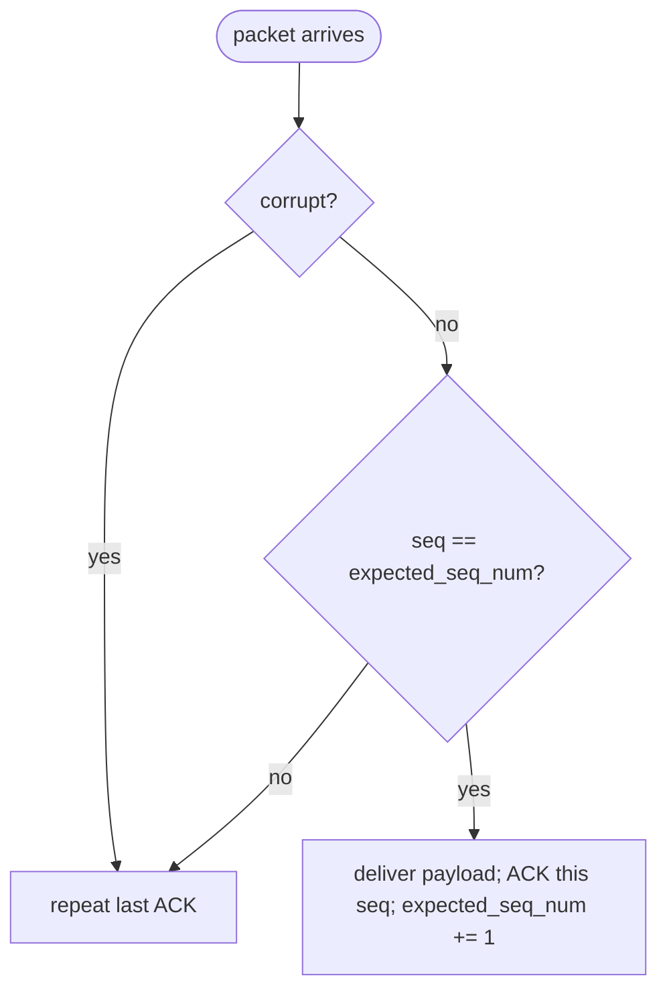

# Go-Back-N Protocol Specification

This document defines the required protocol behavior. The supplied simulator
models an unreliable network layer: packets may be lost or have a bit changed,
but packets that arrive are not duplicated or reordered by the medium.

## Endpoint interface

The simulator constructs two hosts with:

```python
GBNHost(simulator, entity, timer_interval, window_size)
```

It calls three methods:

- `receive_from_application_layer(payload)` when the local application has a
  string to send;
- `receive_from_network_layer(packet)` when a packet reaches this endpoint;
- `timer_interrupt()` when this endpoint's single sender timer expires.

The host may call four simulator methods:

- `pass_to_network_layer(entity, packet)`;
- `pass_to_application_layer(entity, payload)`;
- `start_timer(entity, timer_interval)`;
- `stop_timer(entity)`.

Both hosts send and receive concurrently. Each `GBNHost` therefore maintains
independent sender and receiver state.

### Packet helper interface

The starter also declares five public packet helpers. The grader calls these
methods directly, so their names and basic results are part of the assignment
interface:

- `create_data_pkt(seq_num, payload)` returns one DATA packet as `bytes`;
- `create_ack_pkt(seq_num)` returns one ACK packet as `bytes`;
- `create_checksum(packet)` returns the 16-bit Internet checksum as an integer;
- `is_corrupt(packet)` returns whether the packet checksum is invalid; and
- `unpack_pkt(packet)` returns a dictionary containing the decoded wire fields.

For DATA, the dictionary must contain `packet_type`, `seq_num`, `checksum`,
`payload_length`, and `payload`. For ACK, it must contain `packet_type`,
`seq_num`, and `checksum`. The packet type values are the wire values `0` and
`1`; an `IntEnum` equal to those values is also acceptable. `seq_num`,
`checksum`, and `payload_length` are Python integers. The DATA `payload` is the
decoded Python string, not the encoded wire bytes. Extra dictionary fields are
allowed. The grader does not require a particular exception type from
`unpack_pkt` for malformed input; it grades malformed input through the
endpoint's observable behavior.

## Wire format

All integer fields use network byte order (big endian). Python `struct` format
strings are shown as the unambiguous encoding definition.

### DATA packet

| Field | Type | Size | Value |
|---|---:|---:|---|
| packet type | unsigned short | 2 bytes | `0` |
| sequence number | unsigned int | 4 bytes | packet number |
| checksum | unsigned short | 2 bytes | Internet checksum |
| payload length | unsigned int | 4 bytes | UTF-8 byte length |
| payload | bytes | variable | UTF-8 string bytes |

Header format: `!HIHI`. The packet has exactly `12 + payload_length` bytes.

### ACK packet

| Field | Type | Size | Value |
|---|---:|---:|---|
| packet type | unsigned short | 2 bytes | `1` |
| acknowledged sequence | unsigned int | 4 bytes | highest contiguous DATA received |
| checksum | unsigned short | 2 bytes | Internet checksum |

Format: `!HIH`. An ACK has exactly 8 bytes and no payload.

Sequence numbers are unsigned 32-bit packet numbers. Tests use values far
below wraparound. `4294967295` is reserved as the receiver's initial
"nothing received yet" cumulative ACK value.

## Internet checksum

Use the standard 16-bit Internet checksum. In summary:

1. Set the checksum field to zero while creating a packet.
2. Interpret the bytes as big-endian 16-bit words, padding an odd final byte
   with zero for calculation only.
3. Add the words using end-around carry.
4. Store the one's complement of the sum.

Running the same calculation over an intact packet, including its stored
checksum, produces zero. Any nonzero result means the packet is corrupt.

### Computing it step by step

**1. Pack with a zero checksum, then repack.** The checksum lives inside the
bytes it is computed over, so pack the packet once with `0` in the checksum
field, compute the checksum of those bytes, then repack with the real value:

```python
# Pack with a placeholder checksum of 0.
packet = struct.pack(f"!HIHI{len(payload)}s", 0, seq_num, 0, len(payload), payload)
checksum = create_checksum(packet)
# Repack with the real checksum.
packet = struct.pack(f"!HIHI{len(payload)}s", 0, seq_num, checksum, len(payload), payload)
```

**2. Split the bytes into 16-bit words.** If the packet has an odd number of
bytes, pad it with a single `0x00` byte for the calculation only. Combine each
pair of bytes into one 16-bit word, high byte first:

```python
if len(packet) % 2 == 1:
    packet = packet + b"\x00"
words = [(packet[i] << 8) | packet[i + 1] for i in range(0, len(packet), 2)]
```

**3. Sum the words with end-around carry.** Adding two 16-bit words can overflow
into a 17th bit; that carry is folded back into the low 16 bits:

```python
total = 0
for word in words:
    total += word
    total = (total & 0xFFFF) + (total >> 16)   # fold the carry back in
```

**4. Take the one's complement.** Python integers are wider than 16 bits, so
mask back down to 16 bits:

```python
checksum = ~total & 0xFFFF
```

### Worked example

The DATA packet carrying `"hello"` as sequence 0 packs (with a zero checksum)
into the words `0000 0000 0000 0000 0000 0005 6865 6c6c 6f00`. Summing them
with end-around carry and taking the one's complement gives `0xBC28` — decimal
**48168**. That is the value the debug logs print as `cksum=48168` and store in
the wire bytes as `... bc28 ...`. Re-running the sum over the packet *including*
that stored checksum yields `0`, which is how `is_corrupt` decides a packet
arrived intact.

## Handling corruption

A failed checksum means the packet was altered in transit, so no field can be
trusted -- including the two-byte type. An endpoint therefore cannot tell
whether a corrupt packet was DATA or an ACK, and it must not read the type to
decide. Whenever a received packet is corrupt, repeat the last cumulative ACK
and take no other action:

- if the packet was really DATA, repeating the ACK is exactly the reaction a
  receiver owes a lost or damaged DATA packet;
- if it was really an ACK, the repeated ACK is a harmless duplicate that the
  peer's sender ignores, and the local retransmission timer still recovers the
  ACK that was lost.

Before DATA zero has been accepted, that repeated ACK uses the reserved
sequence number `4294967295`. A packet that instead passes the checksum but
still cannot be decoded is not corruption -- its type is reliable, so treat it
by type (a broken DATA packet repeats the last ACK; any unknown type is
ignored).

### When the packet length is corrupted

Corruption can strike any field, including the payload-length field of a DATA
packet. If you verify the checksum over the entire received byte string first --
the recommended order -- a corrupted length is caught like any other corruption,
because the checksum covers that field too.

If instead your code reads the length to slice out the payload *before*
verifying the checksum, a corrupted length can make that slice or
`struct.unpack` fail outright (for example, `unpack requires a buffer of
134217728 bytes`) before `is_corrupt` ever runs. That failure is expected. Wrap
your decoding in a `try`/`except` and treat any decode failure as a corrupt
packet: repeat your last cumulative ACK, exactly as the corruption rule above
requires. A packet you cannot even decode is corrupt for our purposes.

## Sender behavior

Maintain these conceptual values:

- `window_base`: oldest unacknowledged sequence number;
- `next_seq_num`: sequence number to assign next;
- buffered packets for every number in
  `[window_base, next_seq_num)`;
- application messages waiting for window space.

When the application supplies a message:

1. Send it immediately if `next_seq_num < window_base + window_size`.
2. Otherwise, retain it until cumulative ACKs open space.
3. Start the single timer when sending into an empty outstanding window.

On a valid cumulative ACK numbered `n`:

- ignore it unless `window_base <= n < next_seq_num`;
- remove all acknowledged packets through `n`;
- set `window_base` to `n + 1`;
- stop the timer if no packets remain outstanding, otherwise restart it for
  the new oldest outstanding packet;
- fill newly opened window slots from the application buffer.

On timeout, restart the timer and retransmit every packet in the outstanding
window in sequence-number order. This is the defining Go-Back-N behavior.

Duplicate and out-of-window ACKs do not move the window. A corrupt packet
never moves the window either; handle it with the corruption rule above.

## Receiver behavior

Maintain `expected_seq_num`, initially zero, and the last valid cumulative ACK.

For an intact DATA packet with exactly the expected sequence number:

1. deliver its payload to the application;
2. ACK that sequence number;
3. increment `expected_seq_num`.

For an intact but duplicate or future DATA packet, do not deliver its payload
and do not buffer it; repeat the ACK for the highest contiguous packet already
delivered. Corrupt packets are handled by the corruption rule above, which
also repeats that same ACK.

This rule provides exactly-once, in-order application delivery even when a
sender retransmits packets whose ACK was lost.

## State machines

The original assignment specified the sender and receiver as finite state
machines, each with a single `Wait` state and one self-transition per event.
Below, each machine is drawn as a **decision flowchart** -- one path per event,
which renders far more clearly than a single-state diagram -- followed by the
exact pseudocode. Where the prose above is more specific (the exact ACK bounds
and the reserved sentinel value), the prose governs.

**Reading the flowcharts.** A rounded box is the event that triggers a handler,
a diamond is a decision, and a rectangle is an action the endpoint takes.

### Sender

Initial: `window_base = 0`, `next_seq_num = 0`, `unACKed_buffer = {}`,
`app_layer_buffer = []`.



- **On `receive_from_application_layer(payload)`:**
  ```text
  if next_seq_num < window_base + window_size:
      unACKed_buffer[next_seq_num] = make_pkt(next_seq_num, payload)
      pass_to_network_layer(unACKed_buffer[next_seq_num])
      if window_base == next_seq_num:
          start_timer()
      next_seq_num += 1
  else:
      app_layer_buffer.append(payload)
  ```
- **On `timer_interrupt()`:**
  ```text
  start_timer()
  for i in range(window_base, next_seq_num):
      pass_to_network_layer(unACKed_buffer[i])
  ```
- **On a non-corrupt ACK from `receive_from_network_layer(bytes)`:**
  ```text
  ack_num = get_ack_num(bytes)
  if ack_num >= window_base:
      window_base = ack_num + 1
      stop_timer()
      if window_base != next_seq_num:
          start_timer()
      while app_layer_buffer and next_seq_num < window_base + window_size:
          payload = app_layer_buffer.pop(0)
          unACKed_buffer[next_seq_num] = make_pkt(next_seq_num, payload)
          pass_to_network_layer(unACKed_buffer[next_seq_num])
          if window_base == next_seq_num:
              start_timer()
          next_seq_num += 1
  ```

### Receiver

Initial: `expected_seq_num = 0`, `last_ack = make_pkt(4294967295, ACK)` (the
reserved "nothing received yet" value; the original assignment wrote this as
`make_pkt(-1, ACK)`, which is the same 32-bit value).



- **On non-corrupt DATA with `get_seq_num(bytes) == expected_seq_num`:**
  ```text
  data = extract_payload(bytes)
  pass_to_application_layer(data)
  last_ack = make_pkt(expected_seq_num, ACK)
  pass_to_network_layer(last_ack)
  expected_seq_num += 1
  ```
- **On a corrupt packet:** `pass_to_network_layer(last_ack)`
- **On DATA with `get_seq_num(bytes) != expected_seq_num`:** `pass_to_network_layer(last_ack)`

### Merging the two in a full-duplex host

Each `GBNHost` is both a sender and a receiver, so a single
`receive_from_network_layer` call must serve both machines. For a non-corrupt
packet you read the type and dispatch to the matching machine. For a **corrupt**
packet you cannot -- the type field is as untrustworthy as any other (see
[Handling corruption](#handling-corruption)). The two machines disagree only
here: the sender would do nothing, the receiver would repeat its last ACK. Take
the receiver's action unconditionally. Repeating the last ACK is the correct
reaction to a damaged DATA packet, and a harmless duplicate ACK if the packet
was really an ACK, so it is always safe -- and it is what a correct full-duplex
host does on any corrupt packet.

## Correctness contract

For every finite simulator scenario, after faults stop occurring:

- each receiver eventually obtains the opposite sender's complete message
  list;
- order and duplicate multiplicity are preserved exactly;
- neither sender transmits new DATA outside its fixed window;
- retransmission eventually makes progress after loss or corruption.

The grader does not require a particular private design or an exact packet
count when more than one correct event sequence is possible.
